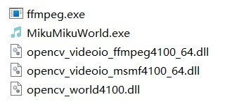
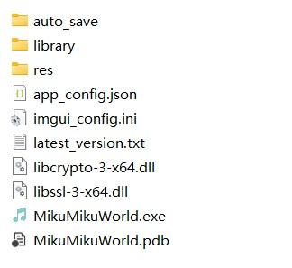
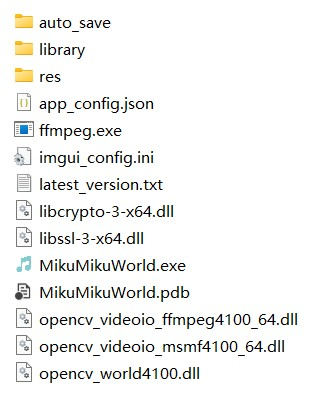
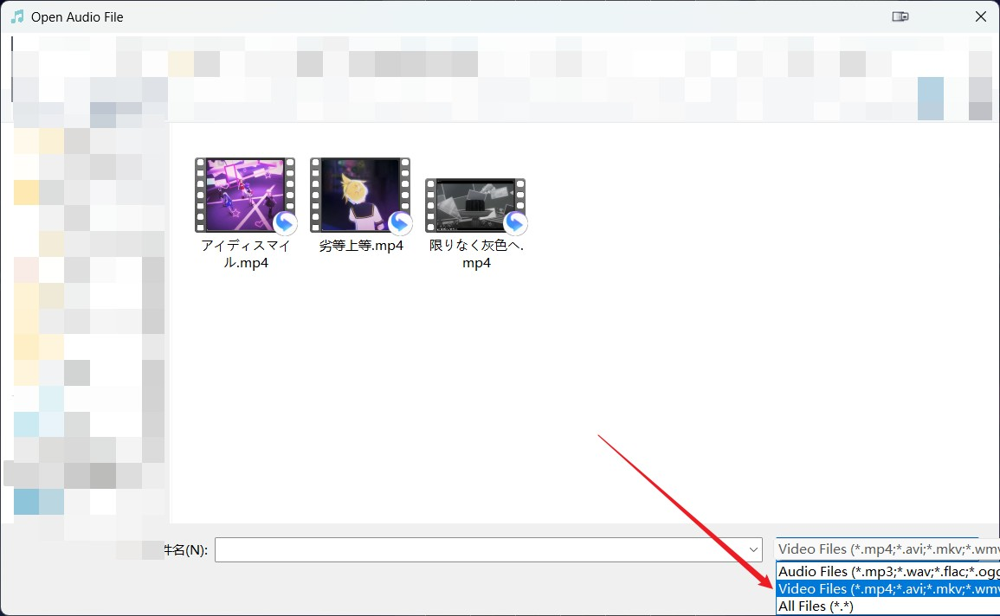
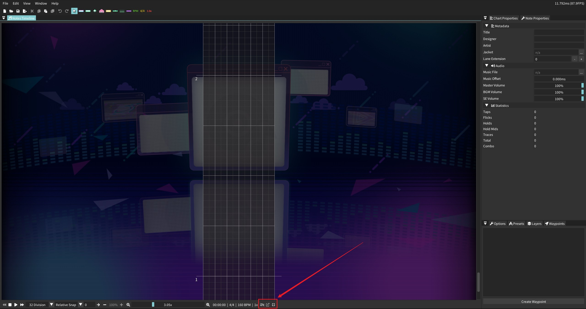

# MMW-Video

**This is a copy of [MikuMikuWorld4CC](https://github.com/sevenc-nanashi/MikuMikuWorld4CC) that can play video synchronously.**

### How to get?

+ If you don't have MikuMikuWorld4CC now, you should first **get it from its original author [here](https://github.com/sevenc-nanashi/MikuMikuWorld4CC)**. I only provide extra units that is needed for video playing in this repository.
+ Now you already have MikuMikuWorld4CC. Then you get units from this repository, which include:
    

    
    

+ **Copy these five files** to the directory where your MikuMikuWorld4CC installed (and **replace** `MikuMikuWorld.exe`, so I advise you to backup your original `MikuMikuWorld.exe`). This directory may be like left image here (If you have not ever openned MikuMikuWorld4CC, your directory may not contain some of them), and you should get your directory like right image here:
    

    
    
    

+ Then you can open `MikuMikuWorld.exe` to enjoy it. Your previous user settings will be reserved.

### How to use?
There are 2 additional things compared to original MikuMikuWorld4CC:
+ When you open a music file, you can also choose a video file. I recommand you use MP4 video especially for high-frame-rate video (FPS > 31)
    

    
    

+ At the bottom of interface, there are 3 new buttons, and the first two can only be used after you open a video file. Just try them, and you will know their functions.
    

    
    

### Note
+ This MMW-Video is developed based on MikuMikuWorld4CC-3.1.2.30. So modification after 3.1.2.30 may be not contained. And it also may not be compatible with too old versions.
+ The copyright of MikuMikuWorld4CC belongs to the original author [@sevenc-nanashi](https://github.com/sevenc-nanashi)
